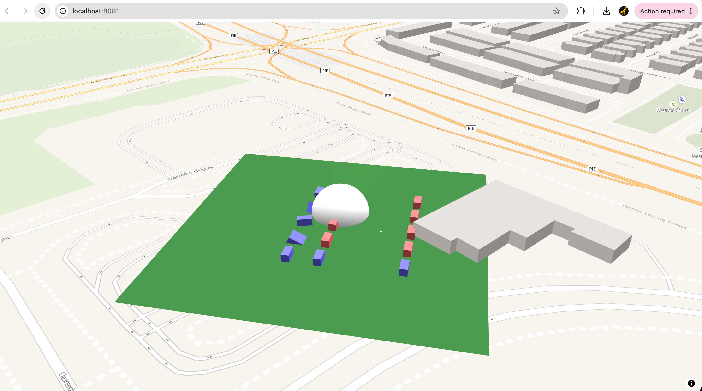

# Babylon.js on MapLibre GL — with a WebGL2 / WebGPU engine layer

A Babylon.js scene rendered into MapLibre GL JS's own WebGL 2 context as a
[custom layer](https://maplibre.org/maplibre-gl-js/docs/API/interfaces/CustomLayerInterface/),
with the Babylon plumbing factored out behind a small engine abstraction
(`src/moc-gfx-engine/`) that can target **either** WebGL 2 or WebGPU.

**[▶ Live demo](https://giraphics.github.io/babylonjs-mapbox-gl-js/)** — needs a
browser with WebGL 2.

This is the successor to [mapbox-babylon-js](https://github.com/giraphics/mapbox-babylon-js),
where the same integration lives in one flat file. The point of this repository
is the layering: nothing above `moc-gfx-engine` mentions Babylon's engine type.



The green ground plane, the sphere and the billboarded boxes are the Babylon
scene, placed at 103.6958 E, 1.3542 N and drawn through MapLibre's pitched
camera. The map uses [OpenFreeMap](https://openfreemap.org/)'s `liberty` style,
which needs no API key or account.

## Architecture

```text
src/index.ts                 MapLibre map + custom layer; hands the GL context in
src/visualizer.ts            owns a renderer, scene and camera; drives per-frame render
src/myscene.ts               the actual content (ground, sphere, billboards)
src/moc-gfx-engine/engine.ts   picks WebGL2 or WebGPU and builds the Babylon engine
src/moc-gfx-engine/renderer.ts async engine init (WebGPU needs awaiting)
src/moc-gfx-engine/scene.ts    GftScene: mercator world matrix, external-context render
src/moc-gfx-engine/camera.ts   GftCamera wrapper
src/moc-gfx-engine/types.ts    ContextOptions passed down from the layer each frame
```

Per frame, `GftScene.renderCallbackExtCtx()` composes the world matrix from the
mercator coordinate and `meterInMercatorCoordinateUnits()`, multiplies it by
MapLibre's view-projection matrix, freezes that onto the camera, recovers the
camera position by inverting it, and calls `wipeCaches()` around the render so
Babylon and MapLibre do not trip over each other's cached GL state.

`useHighPrecisionMatrix: true` is deliberate — at mercator scale, float32
matrices visibly jitter.

## Why MapLibre v4, not v5

The project started on Mapbox GL JS v2 and was moved to MapLibre GL JS so that
it runs without an access token. It is pinned to **v4**: there the custom
layer's `render(gl, matrix)` receives the same view-projection matrix Mapbox v2
passed, so the Babylon side did not change. MapLibre v5 (globe support) changes
the signature to `render(gl, options)` and would need the matrix taken from
`options` and the alignment re-checked.

## Running it

```bash
npm install
npm start
```

The dev server opens on http://localhost:8080 (pass `--port` to change it).

`npm run build` writes `dist/` — a bundle plus a generated `index.html`, which
is plain static output. Requires Node 20+.

## Engine selection, and a bug that modern browsers exposed

`GftEngine` prefers WebGPU and falls back to WebGL. But a `WebGPUEngine` cannot
adopt an externally supplied WebGL 2 context, and the WebGPU branch used to
`return` early in exactly that case — without assigning the engine reference.

When this was written, no stable browser shipped WebGPU, so the code always
took the WebGL fallback and worked. In a current Chrome, `IsSupportedAsync`
resolves true, the WebGPU branch is taken, no engine is created, and the scene
is constructed with a null engine:

```text
TypeError: Cannot read properties of null (reading 'scenes')
```

`engine.ts` now forces the WebGL path whenever it is handed an external
WebGL 2 context, which is the only thing it can do with one. The WebGPU branch
still runs when the engine owns its own canvas.

## State of the inherited boilerplate

From [RaananW/babylonjs-webpack-es6](https://github.com/RaananW/babylonjs-webpack-es6);
two pieces of that scaffolding no longer apply:

- **`npm test` does not run** — `tests/validation.spec.ts` drives boilerplate
  scenes this project does not implement, against `-win32.png` snapshots.
- **`npm run lint` does not run** — there is no ESLint configuration in the
  repository.

Neither is wired into CI.

## Continuous integration

[`.github/workflows/build.yml`](.github/workflows/build.yml) type-checks and
builds the bundle on every push and pull request. Pushes to `master` also
deploy `dist/` to GitHub Pages, which serves the
[live demo](https://giraphics.github.io/babylonjs-mapbox-gl-js/).

One-time setup: **Settings → Pages → Build and deployment → Source: GitHub
Actions**. The build uses relative asset paths, so it works under the
`/babylonjs-mapbox-gl-js/` subpath without extra configuration.

## Credits

Built on [Raanan Weber](http://blog.raananweber.com/)'s
[babylonjs-webpack-es6](https://github.com/RaananW/babylonjs-webpack-es6)
starter (Apache-2.0), with the MapLibre custom-layer integration and the
`moc-gfx-engine` engine layer added on top.
